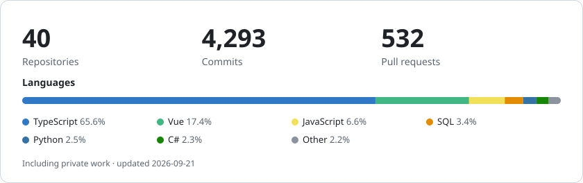

## Hi, I'm Mian 👋

Senior software engineer with 7+ years of experience, mostly as the founding engineer or technical lead at fast-moving startups — the one who sets up the codebase, the standards and the delivery pipeline before there is a team to use them. I care as much about why something gets built as how.

- 🎰 **Tech Lead at [Eeze](https://eeze.com/)** — founding engineer of a new team building a slot aggregation platform with multiple providers and 100+ games.
- 🧵 **First frontend engineer at Frontier.cool** — an AI-powered B2B SaaS for fabric digitisation and search, owned from 0 to 1.
- 🍽️ **Co-founder of [Eatsy](https://partners.eatsy.tech/)** — a restaurant reservation platform serving 52K+ monthly users and adopted by 150+ restaurants, built and grown with a lean team. I work across the whole stack there: customer site, restaurant dashboard, Node and .NET APIs, database and AWS.
- 🧠 On the side: [Brain](https://github.com/minanyang/brain), a Claude Code plugin that turns every coding session into a wiki the agent maintains, and [my-ai-agents](https://github.com/minanyang/my-ai-agents), my versioned agent setup.

### By the numbers

<picture>
  <source media="(prefers-color-scheme: dark)" srcset="./assets/stats-dark.svg">
  
</picture>

Counted from my own commits across public and private repositories, including work done before a username change.
