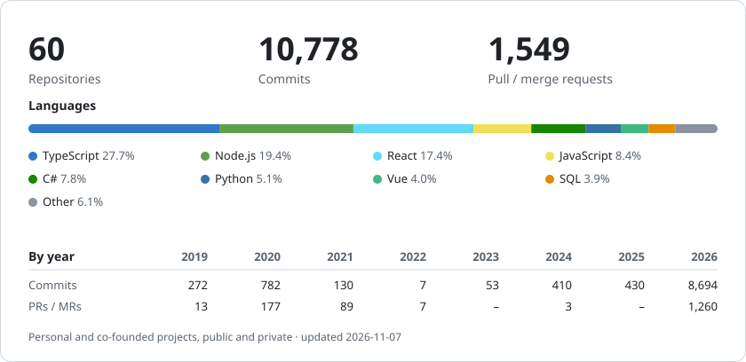

## Hi, I'm Mian 👋

Senior software engineer with 7+ years of experience, mostly as the founding engineer or technical lead at fast-moving startups — the one who sets up the codebase, the standards and the delivery pipeline before there is a team to use them. I care as much about why something gets built as how.

### Open source

-  [**Token2Agent**](https://github.com/minanyang/token2agent) — a free AI/LLM engineering roadmap in English and Traditional Chinese, from how text becomes tokens to agent systems you can evaluate, secure and ship, with a complete lecture for every chapter. Read it at [token2agent.com](https://token2agent.com). 
  <a href="https://token2agent.com">
  <picture>
  <source media="(prefers-color-scheme: dark)" srcset="https://raw.githubusercontent.com/minanyang/token2agent/main/.github/assets/hero-ids-fast-dark.gif">
  
  </picture>
  </a>
- 🔟 [**10x Agent**](https://github.com/minanyang/10x-agent) — a multi-agent workflow for shipping code, as a Claude Code plugin: each ticket is planned, built in its own worktree, verified by scripts, reviewed by an agent that never saw how it was built, then merged.
-  [**Nameable**](https://github.com/minanyang/nameable) — checks whether a project name is really free on every registry, store and domain it ships to, applying each registry's own rules instead of reading "not found" as available. A CLI, MCP server and Claude Code plugin.
- 🧠 [**Brain**](https://github.com/minanyang/brain) — a Claude Code plugin that turns every coding session into a wiki the agent maintains.
-  [**Hotspotly**](https://github.com/minanyang/hotspotly) — a macOS menu bar app that keeps your Mac steady on a phone's hotspot and on Wi-Fi: turns off AWDL, keeps an idle hotspot awake and pins a network.

### Work

- 🎰 **Tech Lead at [Eeze](https://eeze.com/)** — founding engineer of a new team building a slot aggregation platform with multiple providers and 100+ games.
- 🍽️ **Co-founder of [Eatsy](https://partners.eatsy.tech/)** — a restaurant reservation platform serving 66K+ monthly users and adopted by 200+ restaurants, built and grown with a lean team. I work across the whole stack there: customer site, restaurant dashboard, Node and .NET APIs, database and AWS.
- 🧵 **Ex-first frontend engineer at [Frontier.cool](https://frontier.cool/)** — an AI-powered B2B SaaS for fabric digitisation and search, owned from 0 to 1.

### By the numbers

<picture>
  <source media="(prefers-color-scheme: dark)" srcset="./assets/stats-dark.svg">
  
</picture>

Counted from my own commits and PRs on personal and co-founded projects, public and private.
